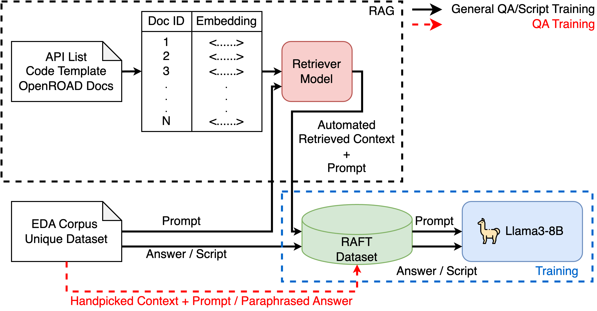

# OpenROAD Assistant
This repository hosts the large-language models that serve as chatbots to OpenROAD. 
It includes the prompt-script and question-answer adpaters and the associated codes to train the models and perform inference. 

## Model Description

## Installation
### Requirements
- Python >= 3.8
- torch = 2.2.2+cu121
- xformers < 0.0.26
- CUDA = 7.5
- CUDA Toolkit = 12.1
